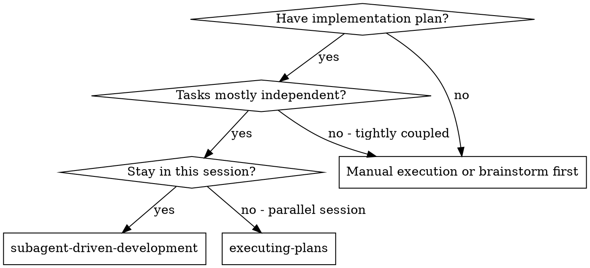
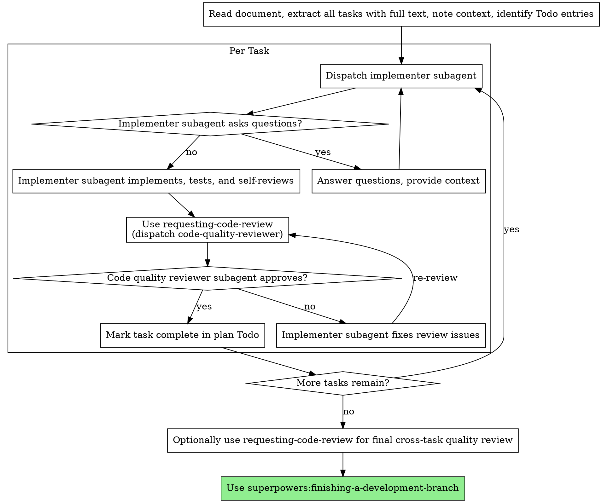

# Subagent-Driven Development

Execute the implementation plan by dispatching fresh subagent per task, with one unified review after each task that checks both task/spec correctness and code quality.

**Why subagents:** You delegate tasks to specialized agents with isolated context. By precisely crafting their instructions and context, you ensure they stay focused and succeed at their task. They should never inherit your session's context or history — you construct exactly what they need. This also preserves your own context for coordination work.

**Core principle:** Fresh subagent per task + unified review after each task = high quality, fast iteration

## Subagent Roles

This workflow uses two per-task subagent roles:

- `implementer` - completes the task
- `code-quality-reviewer` - checks whether the implementation matches the task/spec and whether the code is well-built

If your environment already has these subagents registered with their own system prompts, call them by name. The controller should only provide task-specific context and manage the review loop.

## When to Use



**vs. Executing Plans (parallel session):**
- Same session (no context switch)
- Fresh subagent per task (no context pollution)
- Unified review after each task
- Faster iteration (no human-in-loop between tasks)

## The Process



## Model Selection

Use the least powerful model that can handle each role to conserve cost and increase speed.

**Mechanical implementation tasks** (isolated functions, clear specs, 1-2 files): use a fast, cheap model. Most implementation tasks are mechanical when the plan is well-specified.

**Integration and judgment tasks** (multi-file coordination, pattern matching, debugging): use a standard model.

**Architecture, design, and review tasks**: use the most capable available model.

**Task complexity signals:**
- Touches 1-2 files with a complete spec → cheap model
- Touches multiple files with integration concerns → standard model
- Requires design judgment or broad codebase understanding → most capable model

## Handling Implementer Status

Implementer subagents report one of four statuses. Handle each appropriately:

**DONE:** Proceed to review.

**DONE_WITH_CONCERNS:** The implementer completed the work but flagged doubts. Read the concerns before proceeding. If the concerns are about correctness or scope, address them before review. If they're observations (e.g., "this file is getting large"), note them and proceed to review.

**NEEDS_CONTEXT:** The implementer needs information that wasn't provided. Provide the missing context and re-dispatch.

**BLOCKED:** The implementer cannot complete the task. Assess the blocker:
1. If it's a context problem, provide more context and re-dispatch with the same model
2. If the task requires more reasoning, re-dispatch with a more capable model
3. If the task is too large, break it into smaller pieces
4. If the plan itself is wrong, escalate to the human

**Never** ignore an escalation or force the same model to retry without changes. If the implementer said it's stuck, something needs to change.

## Prompt Templates

Use these subagent roles by name:

- `implementer`
- `code-quality-reviewer`

Use the prompt templates in this directory to shape the task handoff:

- `./implementer-prompt.md` - how to package one task for the implementer
- `./code-quality-reviewer-prompt.md` - how to package one code-quality review (normally triggered via `requesting-code-review`)

These templates are for the **controller's task allocation and payload construction**. They are not the subagents' system prompts. If your environment already defines those subagents separately, keep their system prompts there and use these templates only to decide what information to pass.

## Dispatch Contract

For each per-task subagent dispatch, pass context in two layers:

1. **Role selection** - Choose the correct subagent by role name
2. **Task payload** - Provide only the task-specific context for this dispatch

The task payload should include:
- task name / review name
- full task text or requirements excerpt
- focused context (where this fits, dependencies, constraints)
- working directory or diff/commit range as applicable
- any required output format or status contract

Never make these subagents discover the plan on their own. The controller must curate and inject the relevant context.

Use the prompt templates in this directory as the controller-facing reference for what that payload should contain.

## Example Workflow

```
You: I'm using Subagent-Driven Development to execute this document.

[Read execution document once: docs/plan/feature-plan.md]
[Extract all 5 tasks with full text and context]
[Locate matching Todo entries]

Task 1: Hook installation script

[Get Task 1 text and context (already extracted)]
[Dispatch implementation subagent with full task text + context]

Implementer: "Before I begin - should the hook be installed at user or system level?"

You: "User level (~/.config/superpowers/hooks/)"

Implementer: "Got it. Implementing now..."
[Later] Implementer:
  - Implemented install-hook command
  - Added tests, 5/5 passing
  - Self-review: Found I missed --force flag, added it
  - Ready for review

[Use requesting-code-review to dispatch code-quality-reviewer with workspace diff / changed files]
Code-quality reviewer:
  Strengths: Good test coverage, clean structure
  Issues: None
  Testing Considerations: Existing task tests are sufficient
  Recommendations: None
  Assessment:
    - Ready to pass review? Yes
    - Reasoning: Task matches requirements and implementation quality is solid.

[Mark Task 1 complete in the document Todo section]

Task 2: Recovery modes

[Get Task 2 text and context (already extracted)]
[Dispatch implementation subagent with full task text + context]

Implementer: [No questions, proceeds]
Implementer:
  - Added verify/repair modes
  - 8/8 tests passing
  - Self-review: All good
  - Ready for review

[Use requesting-code-review to dispatch code-quality-reviewer]
Code-quality reviewer:
  Strengths: Core behavior is in place
  Issues:
    - [Important] Missing progress reporting (spec says "report every 100 items")
    - [Important] Added --json flag (not requested)
  Testing Considerations: Add verification for progress reporting behavior
  Recommendations: Remove the extra flag and add the required reporting behavior
  Assessment:
    - Ready to pass review? With fixes
    - Reasoning: Core behavior is in place, but important requirement and scope issues remain.

[Implementer fixes issues]
Implementer: Removed --json flag, added progress reporting

[Use requesting-code-review to dispatch code-quality-reviewer]
Code-quality reviewer: Strengths: Solid. Issues (Important): Magic number (100)

[Implementer fixes]
Implementer: Extracted PROGRESS_INTERVAL constant

[Use requesting-code-review to re-dispatch code-quality-reviewer]
Code-quality reviewer:
  Strengths: Clear constant extraction, solid implementation
  Issues: None
  Testing Considerations: Existing task tests remain sufficient
  Recommendations: None
  Assessment:
    - Ready to pass review? Yes
    - Reasoning: The follow-up fix resolves the remaining correctness and quality concerns.

[Mark Task 2 complete in the document Todo section]

...

[After all tasks]
[Optionally use requesting-code-review for a final cross-task quality review]
Code-quality reviewer:
  Strengths: Requirements are covered and implementation is cohesive
  Issues: None
  Testing Considerations: No additional blockers found
  Recommendations: None
  Assessment:
    - Ready to pass review? Yes
    - Reasoning: Cross-task quality looks solid and no blocking issues remain.

Done!
```

## Advantages

**vs. Manual execution:**
- Subagents follow TDD naturally
- Fresh context per task (no confusion)
- Parallel-safe (subagents don't interfere)
- Subagent can ask questions (before AND during work)

**vs. Executing Plans:**
- Same session (no handoff)
- Continuous progress (no waiting)
- Review checkpoints automatic

**Efficiency gains:**
- No file reading overhead (controller provides full text)
- Controller curates exactly what context is needed
- Subagent gets complete information upfront
- Questions surfaced before work begins (not after)
- Todo state lives in the same execution document as the plan

**Quality gates:**
- Self-review catches issues before handoff
- Unified review checks both correctness and quality
- Review loops ensure fixes actually work
- Review catches missing, extra, and low-quality implementation before task closure

**Cost:**
- More subagent invocations (implementer + reviewer per task)
- Controller does more prep work (extracting all tasks upfront)
- Review loops add iterations
- But catches issues early (cheaper than debugging later)

## Red Flags

**Never:**
- Start implementation on main/master branch without explicit user consent
- Skip review
- Proceed with unfixed issues
- Parallelize tasks that touch the same core files, contracts, or ordered rollout path
- Make subagent read the execution document file (provide full text instead)
- Skip scene-setting context (subagent needs to understand where task fits)
- Ignore subagent questions (answer before letting them proceed)
- Skip review loops (reviewer found issues = implementer fixes = review again)
- Let implementer self-review replace actual review (both are needed)
- Move to next task while either review has open issues

**If subagent asks questions:**
- Answer clearly and completely
- Provide additional context if needed
- Don't rush them into implementation

**If reviewer finds issues:**
- **REQUIRED SUB-SKILL:** Use superpowers:receiving-code-review to evaluate reviewer feedback before acting on it
- First validate whether the feedback is technically sound and in scope for this task
- If valid, implementer (same subagent) fixes them
- If partially valid, fix the valid parts and record explicit reasoning for anything deferred or rejected
- If invalid or out of scope, push back with technical reasoning rather than applying it mechanically
- Reviewer reviews again when changes are made
- Repeat until approved
- Don't skip the re-review

## Parallel Task Scheduling

If the execution document marks tasks as `Parallelizable`, the controller may schedule those tasks concurrently when:

- their dependencies are already satisfied
- they do not compete for the same core files or contracts
- the controller can still keep review and todo updates coherent

Prefer parallel execution when it is clearly safe, but do not parallelize tasks that define shared interfaces or require ordered rollout.

## Todo Updates

The execution document contains a `Todo` section. The controller, not the subagents, updates it.

- Mark a task complete only after implementer output is accepted and the unified review passes
- Keep the `Todo` section synchronized with actual task status
- Do not let implementer or reviewer subagents edit the plan document directly unless the controller explicitly delegates that action

**If subagent fails task:**
- Re-dispatch the implementer with specific fix instructions unless there is a clear reason to switch models or roles
- Don't try to fix manually (context pollution)

## Integration

**Required workflow skills:**
- **superpowers:using-git-worktrees** - REQUIRED: Set up isolated workspace before starting
- **superpowers:writing-plans** - Creates the execution document this skill executes
- **superpowers:requesting-code-review** - REQUIRED: Dispatches `code-quality-reviewer` for unified correctness + quality review
- **superpowers:receiving-code-review** - REQUIRED when handling reviewer feedback before deciding whether to apply fixes
- **superpowers:finishing-a-development-branch** - Complete development after all tasks

**Subagents should use:**
- **superpowers:test-driven-development** - Subagents follow TDD for each task

**Alternative workflow:**
- **superpowers:executing-plans** - Use for parallel session instead of same-session execution
